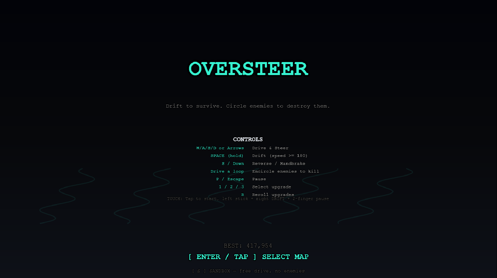
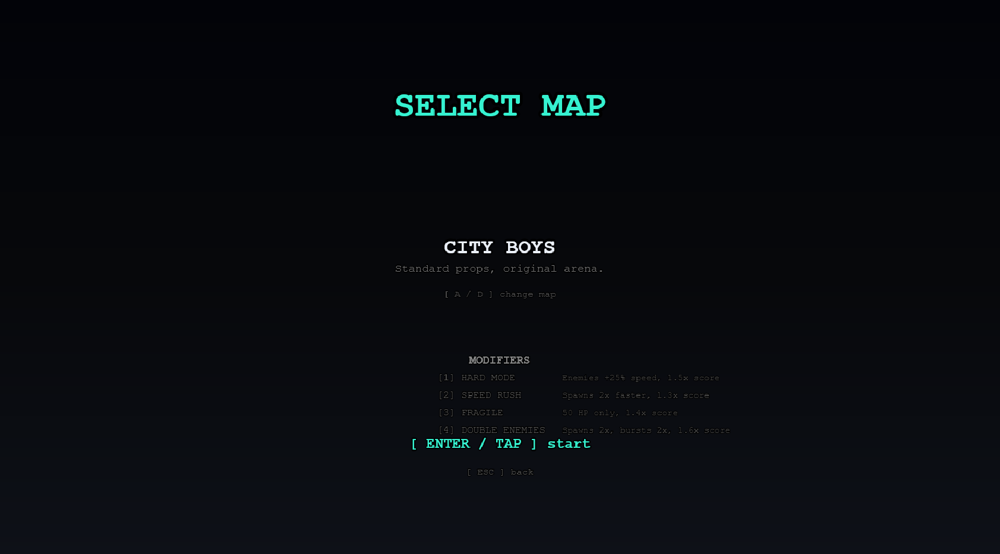
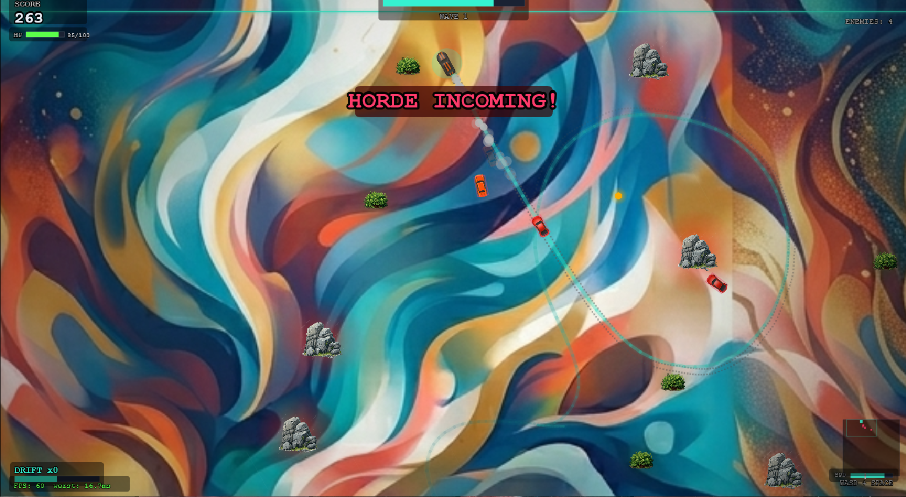
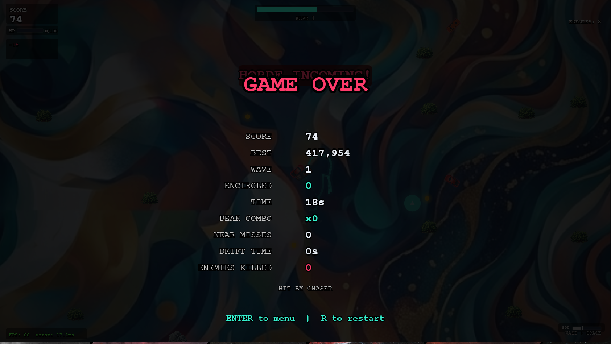
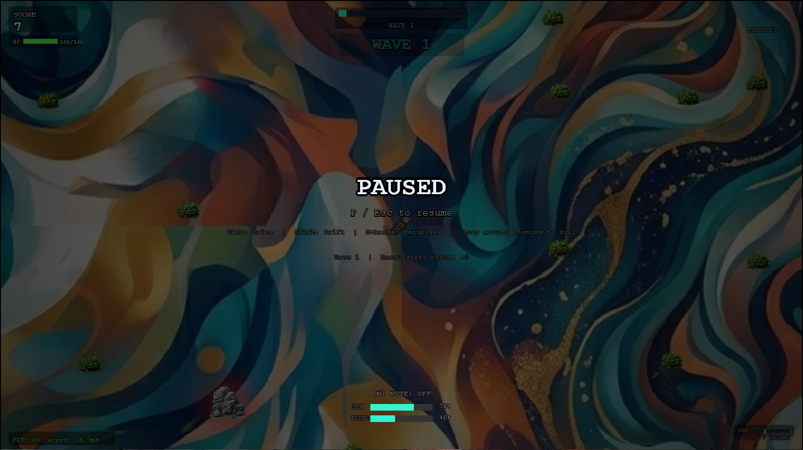

# Oversteer — Game Review

**Date:** 2026-03-22
**Branch:** dev_1.0.0
**Reviewer:** Claude (Senior Game Developer)

---

## 1. Aesthetics

### Visual Identity

Oversteer commits fully to a dark, neon-accented aesthetic that lands somewhere between a retro arcade cabinet and a modern synthwave dashboard. The primary palette — deep navy backgrounds, cyan accent (#35F2D0), and hot pink enemy highlights (#FF3B6B) — creates strong visual contrast and makes gameplay elements instantly readable at speed.

The title screen is clean and understated. "OVERSTEER" in large cyan monospace type dominates the upper quarter, with a subtle pulsing scale animation that adds life without being distracting. Decorative drift trails at low opacity float in the background, reinforcing the game identity without cluttering the screen. The controls list is legible and well-organized. The monospace font choice (Courier New) is thematically appropriate for the mechanical, data-driven feel the game targets.

The map select screen is functional and clear. Difficulty modifiers are laid out with toggle-style key hints, and their score multipliers are visible at a glance. The visual hierarchy is correct: title at top, map name center, modifiers below, action prompt at bottom.

In-game, the background art is a striking contrast to the UI — a painterly, swirling abstract composition with warm organic colors that plays beautifully against the geometric neon overlays of the HUD. The "HORDE INCOMING!" announcement in bold red monospace is immediately eye-catching. The HUD layout is dense but functional: score and HP top-left, wave timer top-center, enemy count top-right, drift combo bottom-left, speed bar bottom-right, and a minimap in the bottom-right corner.

The game-over screen presents a comprehensive stat breakdown with clear label-value pairing. The red "GAME OVER" heading, the use of color to distinguish stat types (cyan for combos, red for enemies killed, amber for best score), and the death cause line ("HIT BY CHASER") all give the player clear feedback on their run.

The pause screen is functional but visually underwhelming compared to the rest of the game. The overlay dims the background to about 60% opacity, which is appropriate, but the text layout feels sparse and the audio controls at the bottom lack the polish of the other screens.

### Visual Effects

The particle and screen effect system is well-architected. The game employs:

- **Skid marks** that persist on the ground during drifts, giving a tactile sense of motion
- **Speed lines** at high velocity (above 70% max speed), rendered in screen space
- **Chromatic aberration** at screen edges during high speed and death sequences
- **Vignette overlay** pre-rendered to an offscreen canvas for performance
- **Directional screen shake** biased toward collision impact direction (70/30 directional-to-random split)
- **Death sequence** with a freeze-slowmo-desaturate three-phase progression

The FXCache system (`fx.js`) pre-renders prop glows and pickup glows to offscreen canvases, which is a thoughtful performance optimization. The per-type enemy death effects (red sparks for chasers, blue for interceptors, golden explosions for elites) add satisfying variety to kills.

### Critique: Aesthetics

**Pause screen readability.** The controls reminder text at `game.js:1405-1407` is rendered in #555 at size 11, which is very difficult to read against the semi-transparent overlay, especially with the colorful background bleeding through at 40% opacity. This line also crams too much information into a single string.

**EventLog panel background persistence.** As noted in project memory, the EventLog panel dark background does not fade with its text entries (referenced at `fx.js:467`). This results in an empty dark rectangle lingering on screen after messages have faded, which looks like a rendering artifact.

**EventLog clipping.** The fixed width of `S(110)` for the EventLog panel (`fx.js:470`) is too narrow for longer messages like "STREAK x5! +250" or "ENCIRCLE x3! +pts", which will clip horizontally.

**Prop contrast on painted backgrounds.** The painted background maps create a gorgeous atmosphere, but small gameplay elements — particularly scraps (radius 7px) and boost zones (radius 22px) — can get visually lost against the busy background. The glow system helps, but the organic swirls compete with pickup indicators at speed.

---

## 2. Gameloop Design

### Core Loop

The core loop is elegant: **drive, drift, encircle, upgrade, repeat**. The trail-encirclement mechanic is genuinely novel — it turns spatial awareness and path planning into the primary combat tool rather than direct weaponry. This forces the player into a high-risk, high-reward playstyle where scoring kills requires committing to a loop path while enemies actively try to intercept you.

The wave structure (combat phase with escalating enemy spawns, followed by a break phase with upgrade selection) provides clear rhythm. The escalation is multi-layered:

- Wave duration increases (30s base, +10s per wave, capped at 120s)
- Spawn intervals tighten (4.0s down to 1.5s over waves 1-5)
- Burst spawning activates from wave 2 onward
- Horde events trigger once per wave (wave 2+) as a mid-wave pressure spike
- Enemy speed bonus scales with score (up to +120 px/s past 2000 pts)
- Damage scales +12% per wave after wave 5

### Enemy Design

Seven enemy types provide meaningful tactical variety:

**Chasers and Interceptors** form the backbone — direct pursuit vs. predictive interception. The Interceptor 0.5s lead time (`entities.js:413`) is subtle but forces the player to vary their trajectory.

**Drifters** add visual chaos and unpredictability with their alternating drive/drift cycles (1.5-3s normal, 1-2.5s drift). They are the most aesthetically interesting enemies because they use the same drift physics as the player.

**Blockers** are the most strategically impactful. They target the trail midpoint (`entities.js:418-419`), directly countering the core encirclement mechanic. This forces the player to vary their looping patterns.

**Flankers** create perpendicular pressure with their strike-charge behavior at close range (under 120px), adding urgency to spatial decisions.

**Bombers** introduce area denial with hazard zones (55px radius, 6s duration, 8 DPS + 0.6x speed debuff), creating persistent terrain threats that alter pathing.

**Elites** are high-value targets (2 HP, larger hitbox, 1.5x lifespan) with visual distinction (pulsing aura, golden death particles).

### Upgrade System

The 26-upgrade pool is diverse and covers multiple strategic axes: speed, defense, trail manipulation, scoring, and hybrid effects. Several standout designs:

- **Drift Shield** (-40% damage while drifting) rewards the core mechanic by making it defensively beneficial
- **Combo Heal** (heal at combo milestones 3/5/8) ties sustain to aggressive play
- **Trail Burn** (trail damages touching enemies) adds passive offense to the trail
- **Speed Demon** (+20% player speed, +10% enemy speed) is a meaningful risk-reward trade

The stackable upgrade system (shield, hp_regen ×3, max_hp, damage_resist, extra_rerolls ×2) provides long-run build depth. The reroll system (3 base, +2 per extra_rerolls stack) gives the player agency over build direction.

### Scoring Depth

Scoring has multiple interlocking systems:

- Passive 4 pts/sec (modified by score_freak)
- Near-miss points (25 for enemies, 15 for hazards, requiring drift state)
- Near-miss streaks (3+ consecutive within 2s grants 50 × streak bonus)
- Drift combo scoring (base 5 pts × combo level per second of drifting)
- Encirclement kills (100 × killCount + 50 × killCount bonus, multiplied by combo level)
- Drift chain multipliers (1.5x/2.0x for re-entering drift within 0.5s)
- Difficulty modifier score multipliers (up to 4.37x combined)

This creates a clear skill ceiling: expert players chain drifts, accumulate near-misses to build combo, then execute large encirclements at high combo for multiplicative scoring.

---

## 3. Strengths

**Mechanical originality.** The trail-encirclement kill mechanic is the strongest feature. It is conceptually clean, easy to understand ("draw a loop around enemies"), and deeply rewarding to master. The tension between needing to complete a loop (which requires time and space) and the pressure of enemy pursuit creates organic difficulty.

**Physics feel.** The shared physics engine (`physics.js`) applies to both player and enemies, creating consistent movement behavior. The drift system — with its lateral friction drop (8.5 to 3.2), forward drag increase (1.7 to 2.1), and velocity decomposition into forward/lateral components — produces a satisfying slide feel. The handbrake mechanic (2x turn rate for 0.3s with 1800 px/s deceleration) adds a secondary movement tool.

**Layered progression within a run.** The combination of wave-based difficulty escalation, score-gated enemy type unlocks, upgrade choices, and combo systems means no two runs play identically. The enemy pool expanding at score thresholds (1000, 1500, 2000, 2500, 3000) rather than wave number is a smart design choice — it ties enemy diversity to player performance rather than time survived.

**Juice and feedback.** The game excels at making actions feel impactful. Near-misses trigger a brief 0.85x slowmo, a ring particle, a flash, and a sound cue. Drift chain initiation produces escalating particle colors (white, cyan, purple, gold), zoom pulses, and EventLog callouts. Elite kills produce golden particle explosions with screen shake. The death sequence (freeze, slowmo, shatter particles, red ring, desaturate) is genuinely dramatic.

**Performance consciousness.** The codebase consistently demonstrates performance awareness: FXCache pre-rendering, swap-and-pop for array removal, chunk-based prop collision checking, viewport-clipped background rendering, and PerfMon diagnostics in the HUD.

**Difficulty modifiers.** The four toggleable modifiers provide meaningful challenge variety with proportional score rewards, giving experienced players reasons to replay.

---

## 4. Areas for Improvement

### Game Balance

**Horde event triggers on wave 1.** At `waves.js:169`, the guard condition is `this.waveIndex >= 1`, but the code comment says "skip wave 1." Since waveIndex starts at 1 after the first `startWave()` call, this condition is always true, meaning horde events can trigger on the very first wave. The CLAUDE.md documentation states horde events should begin at "wave 2+." The condition should be `this.waveIndex >= 2`.

**Horde max count is extremely high.** `CFG.HORDE_MAX_COUNT` is set to 40 at `logic.js:108`, but the CLAUDE.md documents it as max 15. At `HORDE_WAVE_GROWTH` of 0.5, the formula `5 + floor(wave * 0.5)` reaches 15 by wave 20 and 40 by wave 70. While late waves may never reach 40 practically, the documented cap of 15 better reflects intended design. The config value should match the documented ceiling.

**trail_boost pickup does not decay.** When a trail_boost pickup is collected (`game.js:877`), it permanently adds +200 to `Trail.MAX_POINTS` (capped at 800). The CLAUDE.md states "+100 trail MAX_POINTS for 3s," implying a temporary buff. The current implementation is a permanent, stackable increase. If multiple trail_boost pickups are collected, MAX_POINTS can reach 800 and stay there indefinitely.

**Speed Rush and Double Enemies stack multiplicatively on spawn intervals.** If both modifiers are active, `CFG.SPAWN_INTERVAL_INITIAL` and `CFG.SPAWN_INTERVAL_MIN` are each multiplied by 0.5 twice (`game.js:383-384` and `game.js:393-394`), resulting in 0.25x spawn intervals (effectively 4x enemy density). Combined with doubled burst count (4), this creates an extreme difficulty spike that may feel unfair rather than challenging. Consider either preventing stacking or applying diminishing returns.

**Combo decay is asymmetric with drift requirement.** Combo decays when not drifting (`entities.js:210-211`) at 2.0 per second (1.0 with combo_master). Since near-misses — the primary combo builder — require the player to already be drifting, the combo system inherently punishes the transition time between drifts. Players who briefly stop drifting to reposition lose combo, even if they are actively maneuvering toward enemies. Consider a brief grace period (0.3-0.5s) before combo decay begins.

**Damage scaling has no practical ceiling until wave 22.** With `DMG_SCALE_MAX` at 3.0 and `DMG_SCALE_PER_WAVE` at 0.12 (both in `logic.js:100-101`), damage triples by wave 22. A Flanker at wave 22 deals 60 damage per hit (base 20 × 3.0). Combined with 0.5s invulnerability window (`HIT_INVULN`, `logic.js:90`), two rapid sequential hits from different enemies deal 120 damage — more than the base 100 HP. The max_hp and damage_resist upgrades help, but the scaling curve may be too steep for runs that reach wave 15+.

### Mechanical Issues

**Blocker AI depends on `player._trailMidpoint`.** The trail midpoint is computed in `game.js:698-708` and attached directly to the player object as `_trailMidpoint`. This coupling means the Blocker AI only works when the game state machine is running the PLAYING update. If Trail has fewer than 10 points, `_trailMidpoint` is null and the Blocker defaults to chasing the player directly, making it behaviorally identical to a slow Chaser. Consider computing a fallback target (e.g., midpoint between player and nearest wall).

**Near-miss only works while drifting.** The collision check at `game.js:976` requires `this.player.drifting` to be true for a near-miss to register. This is documented behavior, but it means players who master tight non-drift maneuvering around enemies receive zero reward. Consider whether non-drift near-misses at reduced point value could add depth.

**Trail boost pickup discrepancy.** As noted above, the trail_boost implementation at `game.js:877` adds +200 to MAX_POINTS permanently, but CLAUDE.md documents it as "+100 trail MAX_POINTS for 3s." The code does not implement any timer-based reversal.

### User Experience

**No visual preview of maps.** The map select screen shows only a name and one-line description. Given that the maps have distinct painted backgrounds and different prop pools, a thumbnail preview or small background sample would help players make informed choices.

**Upgrade card descriptions are terse.** Several upgrade descriptions do not communicate their full effect. For example, speed_demon says "+20% speed, enemies +10% speed" but does not clarify whether this is additive or multiplicative, or that it adds a flat +40 px/s to enemy speed bonus. damage_resist says "Take 25% less damage" but does not indicate diminishing returns on stacking.

**No indication of stackable upgrades.** When a stackable upgrade (hp_regen, max_hp, damage_resist, shield, extra_rerolls) appears in the upgrade selection, there is no visual indicator showing the current stack count or remaining stacks. A player seeing "Auto Repair" for the third time has no way to know whether the cap has been reached without memorizing it.

**Pause screen text overlap potential.** The pause screen renders upgrades, difficulty info, and audio controls in a column that grows downward. With many upgrades collected, the upgrade list (`game.js:1418-1423`) can overlap with the difficulty indicator (`game.js:1428-1431`) and audio controls (`game.js:1435-1453`).

**Tutorial is easily missed.** The tutorial message ("Drive a loop to encircle enemies and destroy them") appears for only 6 seconds during wave 1. For new players who are focused on survival and learning controls, this window is too short. The 0.5s fade-in/out further reduces readable time. Consider extending to 10s or making it persistent until the first encirclement.

### Documentation

**CLAUDE.md is thorough and well-maintained.** The module load order table, game state diagram, and per-system documentation are comprehensive. The coding conventions section captures institutional knowledge effectively.

**Minor documentation drift:**

- Hard Mode is documented as "Enemy speed +100 px/s" in CLAUDE.md modifiers table, but `game.js:379` confirms this is correct (+100 to speedBonus). However, the map select screen at `game.js:1718` displays "Enemies +25% speed" — these are different claims. The actual effect is +100 px/s additive, not +25%.
- The CLAUDE.md states `WAVE_COMBAT` base is 30s (`CFG.WAVE_COMBAT_WAVE1`), but `CFG.WAVE_COMBAT` is set to 25 at `logic.js:49`. The `WAVE_COMBAT_WAVE1` value of 30 at `logic.js:145` is what is actually used in wave timing. The standalone `WAVE_COMBAT` field at line 49 appears unused in the wave system (it is only referenced in the HUD progress bar fallback at `game.js:63`).

---

## 5. Overall Verdict

Oversteer is a mechanically inventive arena survival game with a genuinely original core mechanic. The trail-encirclement system transforms spatial reasoning and path planning into combat, creating a distinctive gameplay feel that stands apart from typical top-down shooters or roguelikes. The drift physics are tuned to feel responsive and rewarding, and the layered scoring systems provide depth for players who want to optimize.

The visual presentation is strong — the contrast between painterly backgrounds and neon-geometric UI creates a memorable aesthetic, and the particle/screen effect systems deliver satisfying feedback on every meaningful action. The seven enemy types and 26 upgrades provide enough variety for meaningful replayability.

The primary areas that would benefit from attention are: the horde-on-wave-1 bug, the permanent trail_boost pickup (contradicting documented temporary behavior), the Hard Mode description mismatch between UI and actual effect, and quality-of-life improvements to upgrade card information density. The balance curve is aggressive but generally fair, with the notable exception of stacked Speed Rush + Double Enemies modifiers creating potentially unplayable spawn rates.

For a browser-based game built with vanilla JavaScript and canvas rendering, the technical execution is impressive. The modular architecture, performance-conscious rendering pipeline, and comprehensive test coverage demonstrate professional-grade engineering discipline.

**Rating: Strong foundation with room for polish.** The core mechanics are sound and the game is fun to play. Addressing the identified bugs and UX gaps would elevate it from a compelling prototype to a polished product.

---

## Appendix: Issue Summary

| Priority | File | Line(s) | Issue |
|----------|------|---------|-------|
| Bug | waves.js | 169 | Horde triggers on wave 1 (`>= 1` should be `>= 2`) |
| Bug | game.js | 877 | trail_boost is permanent +200; docs say temporary +100 for 3s |
| Bug | game.js | 1718 | Hard Mode UI says "+25% speed"; actual effect is +100 px/s flat |
| Balance | logic.js | 108 | HORDE_MAX_COUNT is 40; docs say 15 |
| Balance | game.js | 383-396 | Speed Rush + Double Enemies stack to 0.25x spawn intervals |
| Balance | entities.js | 210-211 | Combo decay starts instantly on drift end; no grace period |
| UX | game.js | 1405-1407 | Pause screen controls text too dim and crowded |
| UX | fx.js | 467-470 | EventLog background does not fade; fixed width clips long messages |
| UX | game.js | 748 | Tutorial only 6s; easily missed by new players |
| UX | waves.js | 563-617 | No stack count or max indicator on upgrade cards |
| Docs | logic.js | 49 vs 145 | WAVE_COMBAT (25) vs WAVE_COMBAT_WAVE1 (30) — unused field |
